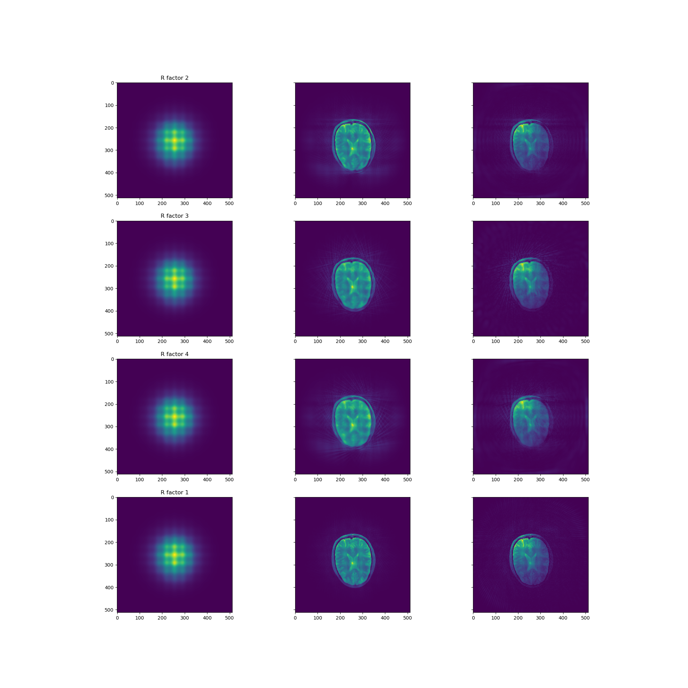

# ismrm19_challenge
Here we tackle the SENSE paper, as a challenge from ISMRM 
[Source](https://blog.ismrm.org/2019/04/02/ismrm-reproducible-research-study-group-2019-reproduce-a-seminal-paper-initiative/)

In that challenge they request certain images.. I have tried to reconstruct these and put them in a nice README.md

 
 The first question we tackle is the following. We show the results from both the heart and the brain data.
    
    Subsample the provided brain data by factors 2,3 and 4 (48, 32 and 24 projections), do a reconstruction, calculate 
    the error to the 96 projections reconstruction and plot the error and the number of iterations according to
    the results in Figure 4 in [1]. 
     
    

**Fig. 1:** Requested iteration behaviour of the brain data

**Fig. 2:** Requested iteration behaviour of the heart data

The next question was 

    For the same data, show reconstruction results for different iteration numbers and a version from a single receive coil according to the results in Figure 5. 
     
Sorry for the bad plotting.. The rows are the different loop factors. 
- The first column shows the first reconstruction iteration;
- The second column the final reconstruction with all coils;
- The third column shows one coil reconstruction.
    

**Fig. 3:** Requested reconstruciton behaviour of the brain data

**Fig. 4:** Requested reconstruciton behaviour of the heart data

Sadly I did not have time to fix the last question

    Reconstructions of the provided cardiac data using the first 55, 33, 22 and 11 projections corresponding to the cardiac results in Figure 6.
    
    